# Report funzionale Cibarius

Giro di prova automatico eseguito il 3 ottobre 2026 su `http://31.220.82.50:5182`
(build di sviluppo Vite del branch `cursor/qa-report-funzionale-e688`).

I difetti descritti qui sono stati corretti nello stesso ciclo di lavoro: gli
screenshot allegati vengono dall'ultimo giro, quello sulla versione corretta.
Dove il comportamento è cambiato lo trovi segnalato schermata per schermata, e
il riepilogo delle correzioni è in fondo.

## 1. Introduzione

Cibarius è un'applicazione web progressiva per la gestione degli alimenti.
Lo stesso impianto dati serve tre profili diversi:

- **A casa** — dispensa, frigo e congelatore di una famiglia, con avvisi di
  scadenza e ricette costruite su quello che c'è davvero in casa.
- **Ristorazione** — registro HACCP, temperature, etichette di preparazione con
  QR e magazzino a lotti.
- **Professionisti** — piani alimentari e diario di aderenza per nutrizionisti
  e dietisti.

Il front-end è React 18 + Vite con Tailwind e shadcn/ui; back-end, autenticazione
e storage sono su Supabase, con le email transazionali gestite da funzioni edge
che si appoggiano a Resend.

### Come è stato eseguito il test

Lo script `scripts/auto_test_report.js` guida un browser Chromium headless a
1280×800 (densità 2×, quindi screenshot a 2560×1600) e ripercorre da solo
l'intero percorso di un utente nuovo:

1. visita le otto pagine del sito pubblico, aprendo una domanda delle FAQ e
   contando link di navigazione e call to action;
2. si registra con un account inedito (`demo_tester_<timestamp>@example.com`)
   scegliendo il profilo *Utente*;
3. si disconnette aprendo un contesto browser pulito ed esegue il login con le
   credenziali appena create;
4. attraversa le quindici schermate dell'app consumer interagendo con gli
   elementi principali (ricerca prodotti, apertura del flusso di inserimento,
   compilazione della lista della spesa, conteggio dei widget);
5. prova ad aprire due aree riservate ad altri ruoli per verificare le guardie
   di permesso.

Ogni schermata produce uno screenshot numerato in `report/screenshots/` e una
riga in `report/results.json` con URL, note dell'interazione e eventuali errori
di console.

**Esito complessivo: 30 schermate catturate, 0 errori di console e 0 errori
JavaScript su tutto il percorso.** L'account di prova usato per questo report è
`demo_tester_1791037187943@example.com`.

### Dati di prova

Un account appena creato ha dispensa vuota e le schermate non mostrerebbero
nulla di significativo. Lo script si ferma quindi subito dopo la registrazione e
riparte quando trova il file sentinella `report/.seeded`: nella pausa sono stati
caricati dieci prodotti distribuiti fra frigo, dispensa e congelatore, con
scadenze scaglionate da oggi a nove mesi, così da popolare avvisi, filtri e
suggerimenti anti-spreco.

## 2. Diagramma di flusso UX

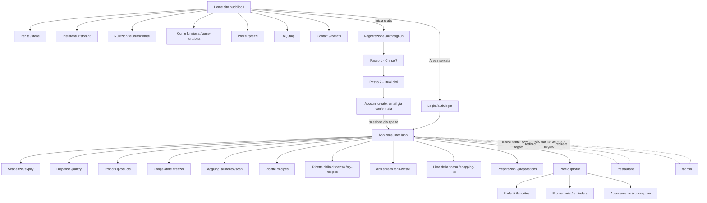
```mermaid
graph TD
    A["Home sito pubblico /"] --> B["Per te /utenti"]
    A --> C["Ristoranti /ristoranti"]
    A --> D["Nutrizionisti /nutrizionisti"]
    A --> E["Come funziona /come-funziona"]
    A --> F["Prezzi /prezzi"]
    A --> G["FAQ /faq"]
    A --> H["Contatti /contatti"]

    A -->|"Inizia gratis"| I["Registrazione /auth/signup"]
    A -->|"Area riservata"| M["Login /auth/login"]

    I --> I1["Passo 1 - Chi sei?"]
    I1 --> I2["Passo 2 - I tuoi dati"]
    I2 --> I3["Account creato, email gia confermata"]
    I3 -->|"sessione gia aperta"| N

    M --> N["App consumer /app"]

    N --> O["Scadenze /expiry"]
    N --> P["Dispensa /pantry"]
    N --> Q["Prodotti /products"]
    N --> R["Congelatore /freezer"]
    N --> S["Aggiungi alimento /scan"]
    N --> T["Ricette /recipes"]
    N --> U["Ricette dalla dispensa /my-recipes"]
    N --> V["Anti spreco /anti-waste"]
    N --> W["Lista della spesa /shopping-list"]
    N --> X["Preparazioni /preparations"]
    N --> Y["Profilo /profile"]

    Y --> Z1["Preferiti /favorites"]
    Y --> Z2["Promemoria /reminders"]
    Y --> Z3["Abbonamento /subscription"]

    N -.->|"ruolo utente: accesso negato"| AA["/restaurant"]
    N -.->|"ruolo utente: accesso negato"| AB["/admin"]
    AA -.->|"redirect"| N
    AB -.->|"redirect"| N
```

## 3. Analisi schermata per schermata

### 3.1 Home del sito pubblico

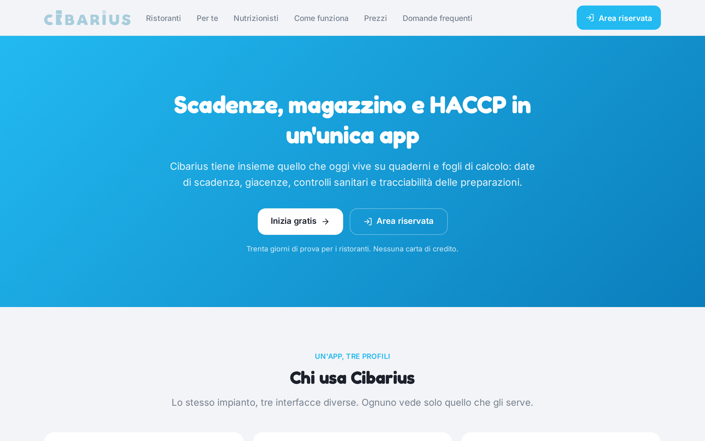

**Descrizione e scopo.** Pagina di atterraggio che presenta il prodotto con un
unico messaggio ("Scadenze, magazzino e HACCP in un'unica app") e smista subito
il visitatore verso la registrazione o l'accesso.

**Elenco funzionalità.**

| Elemento | Funzione |
| --- | --- |
| Logo Cibarius | Riporta alla home del sito pubblico |
| Menu: Ristoranti, Per te, Nutrizionisti, Come funziona, Prezzi, Domande frequenti | Sei voci di navigazione verso le pagine tematiche |
| Pulsante "Area riservata" (in alto a destra) | Porta a `/auth/login` |
| Pulsante "Inizia gratis" | Porta a `/auth/signup` |
| Pulsante "Area riservata" (nell'hero) | Secondo accesso al login, per chi è già cliente |
| Nota "Trenta giorni di prova per i ristoranti. Nessuna carta di credito." | Rassicurazione sul rischio di prova |
| Sezione "Chi usa Cibarius" | Tre schede (Ristoranti, A casa, Nutrizionisti) con link "Scopri" verso le pagine dedicate |

**Esito test.** ✅ OK — 8 link di navigazione e 7 call to action verso l'area
riservata rilevati, nessun errore di console.

---

### 3.2 Sito — Per te (uso domestico)

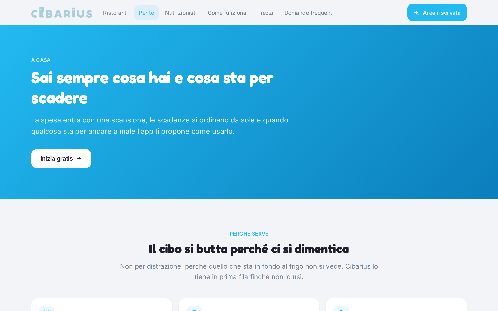

**Descrizione e scopo.** Pagina di prodotto per l'utente privato. Spiega il caso
d'uso domestico: la spesa entra con una scansione, le scadenze si ordinano da
sole e l'app propone come consumare quello che sta per andare a male.

**Elenco funzionalità.**

| Elemento | Funzione |
| --- | --- |
| Occhiello "A CASA" + titolo | Qualificano il pubblico della pagina |
| Pulsante "Inizia gratis" | Registrazione diretta |
| Voce "Per te" evidenziata nel menu | Indicatore di pagina corrente |
| Sezione "Il cibo si butta perché ci si dimentica" | Tre schede che spiegano il problema e la risposta dell'app |

**Esito test.** ✅ OK — 6 call to action rilevate, nessun errore di console.

---

### 3.3 Sito — Ristoranti

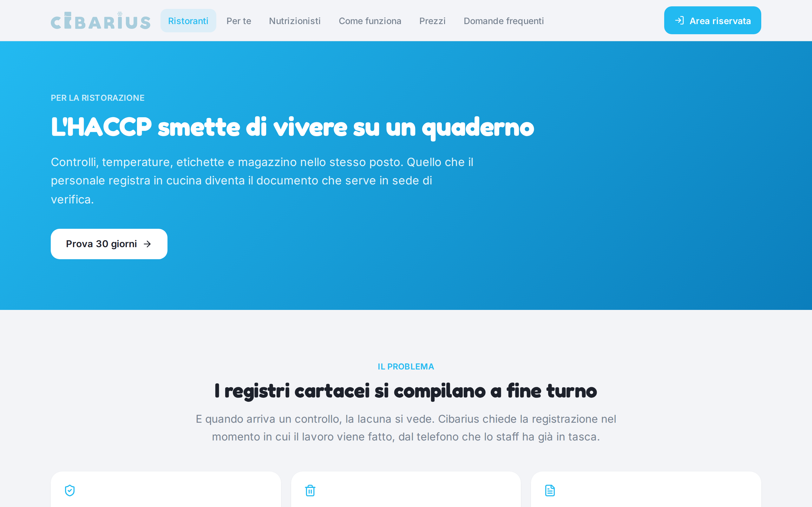

**Descrizione e scopo.** Pagina rivolta alla ristorazione professionale, centrata
sul passaggio dal registro HACCP cartaceo a quello digitale.

**Elenco funzionalità.**

| Elemento | Funzione |
| --- | --- |
| Occhiello "PER LA RISTORAZIONE" + titolo | Qualificano il pubblico |
| Pulsante "Prova 30 giorni" | Avvia la registrazione con il periodo di prova del piano Ristorante |
| Sezione "I registri cartacei si compilano a fine turno" | Tre schede (conformità, sprechi, documenti) che illustrano il problema |

**Esito test.** ✅ OK — nessun errore di console.

---

### 3.4 Sito — Nutrizionisti

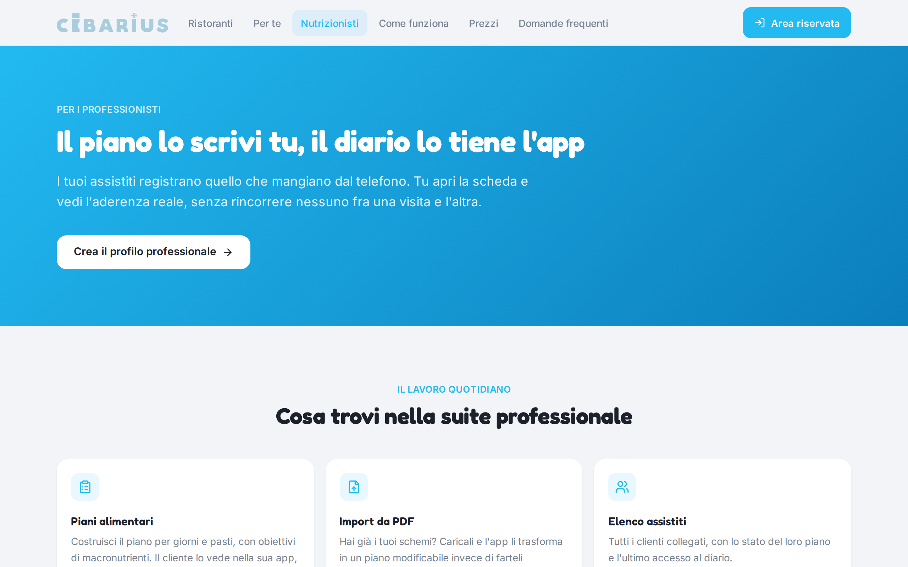

**Descrizione e scopo.** Pagina per i professionisti dell'alimentazione: il piano
lo scrive il nutrizionista, il diario alimentare lo tiene l'app sul telefono
dell'assistito.

**Elenco funzionalità.**

| Elemento | Funzione |
| --- | --- |
| Pulsante "Crea il profilo professionale" | Registrazione con profilo Professionista |
| Scheda "Piani alimentari" | Costruzione del piano per giorni e pasti con obiettivi di macronutrienti |
| Scheda "Import da PDF" | Caricamento di schemi già esistenti, trasformati in piani modificabili |
| Scheda "Elenco assistiti" | Lista dei clienti collegati con stato del piano e ultimo accesso al diario |

**Esito test.** ✅ OK — nessun errore di console.

---

### 3.5 Sito — Come funziona


**Descrizione e scopo.** Racconta i tre percorsi d'uso in quattro passi ciascuno,
chiarendo che cambia l'interfaccia ma non il modo in cui i dati vengono
registrati.

**Elenco funzionalità.**

| Elemento | Funzione |
| --- | --- |
| Blocco "Al ristorante" con link "Dettagli" | Quattro schede numerate: configura il locale, carica la merce, lavora il turno, tieni i conti |
| Blocchi analoghi per gli altri due profili | Stessa struttura a quattro passi, raggiungibili scorrendo |

**Esito test.** ✅ OK — nessun errore di console.

---

### 3.6 Sito — Prezzi

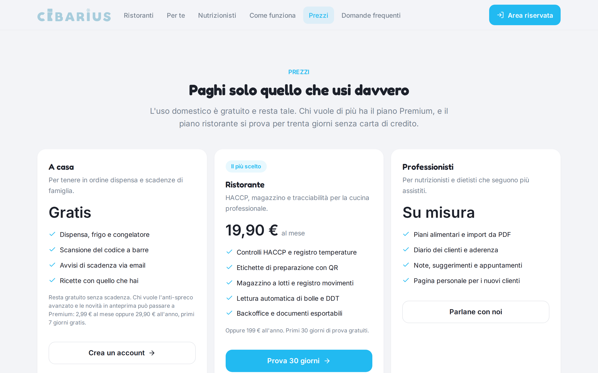

**Descrizione e scopo.** Confronto dei tre piani commerciali.

**Elenco funzionalità.**

| Elemento | Funzione |
| --- | --- |
| Piano "A casa — Gratis" | Dispensa/frigo/congelatore, scansione barcode, avvisi email, ricette; pulsante "Crea un account" |
| Nota sul piano Premium | 2,99 € al mese oppure 29,90 € all'anno, primi 7 giorni gratis: gli stessi importi che l'app chiede alla cassa |
| Piano "Ristorante — 19,90 € al mese" (badge "Il più scelto") | HACCP, etichette QR, magazzino a lotti, lettura bolle e DDT, backoffice; pulsante "Prova 30 giorni" |
| Piano "Professionisti — Su misura" | Piani alimentari, diario clienti, note e appuntamenti; pulsante "Parlane con noi" |
| Nota "Oppure 199 € all'anno" | Alternativa annuale al piano Ristorante |

**Esito test.** ✅ OK — nessun errore di console. Questa schermata viene dalla
versione corretta: prima la pagina si fermava a "Gratis" e del piano Premium,
che pure esisteva dentro l'app, non diceva nulla.

---

### 3.7 Sito — Domande frequenti

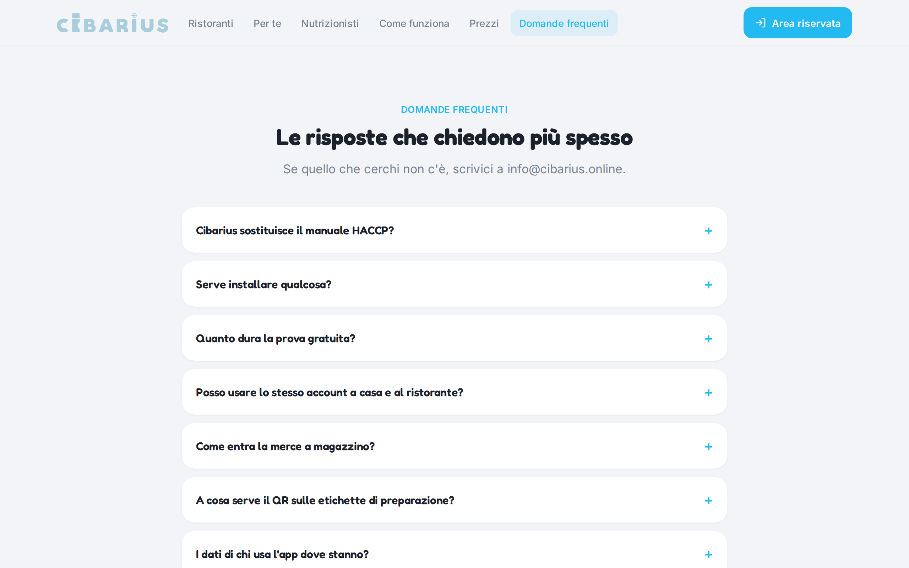

**Descrizione e scopo.** Elenco a fisarmonica delle domande ricorrenti, con un
rimando a `info@cibarius.online` per quelle non coperte.

**Elenco funzionalità.**

| Elemento | Funzione |
| --- | --- |
| Sette pannelli espandibili (`+`) | Cibarius sostituisce il manuale HACCP? / Serve installare qualcosa? / Quanto dura la prova gratuita? / Posso usare lo stesso account a casa e al ristorante? / Come entra la merce a magazzino? / A cosa serve il QR sulle etichette di preparazione? / I dati di chi usa l'app dove stanno? |
| Indirizzo email nel sottotitolo | Canale di contatto diretto |

**Esito test.** ✅ OK — apertura della prima domanda eseguita dallo script,
nessun errore di console.

---

### 3.8 Sito — Contatti

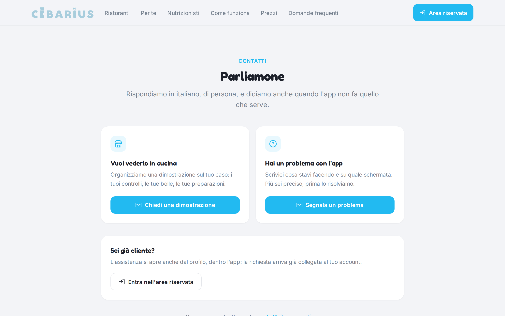

**Descrizione e scopo.** Smistamento delle richieste in arrivo in tre canali
distinti: richiesta di demo, segnalazione di un problema, accesso all'assistenza
per i clienti già attivi.

**Elenco funzionalità.**

| Elemento | Funzione |
| --- | --- |
| Scheda "Vuoi vederlo in cucina" + pulsante "Chiedi una dimostrazione" | Richiesta di demo (apre il client di posta) |
| Scheda "Hai un problema con l'app" + pulsante "Segnala un problema" | Segnalazione di bug (apre il client di posta) |
| Scheda "Sei già cliente?" + pulsante "Entra nell'area riservata" | Rimanda all'assistenza interna all'app, già collegata all'account |
| Indirizzo `info@cibarius.online` a piè di pagina | Contatto diretto |

**Esito test.** ✅ OK — nessun errore di console. La pagina non ha un modulo di
contatto compilabile: usa link `mailto:`, quindi il tentativo dello script di
riempire un campo email non ha trovato nulla da compilare (comportamento atteso).

---

### 3.9 Registrazione — passo 1, scelta del profilo

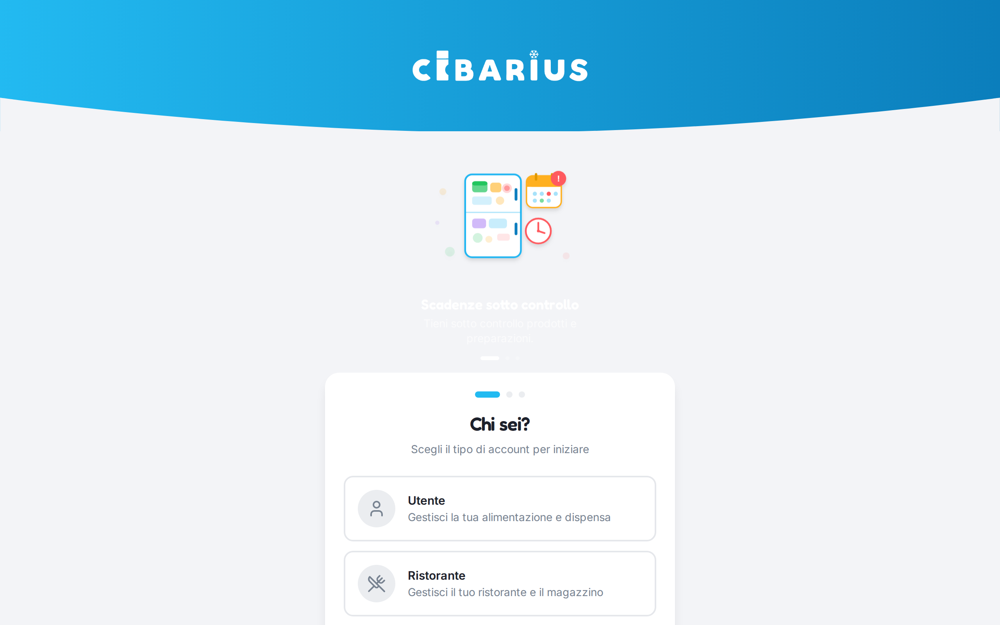

**Descrizione e scopo.** Primo passo della procedura guidata in tre schermate.
Chiede "Chi sei?" perché il tipo di account determina ruolo, home page e
funzionalità visibili dopo l'accesso.

**Elenco funzionalità.**

| Elemento | Funzione |
| --- | --- |
| Carosello illustrato in alto ("Scadenze sotto controllo") | Tre slide promozionali con indicatori a pallini |
| Indicatore di avanzamento (3 segmenti) | Mostra a che punto si è della registrazione |
| Scheda "Utente — Gestisci la tua alimentazione e dispensa" | Crea un account con ruolo `user` |
| Scheda "Ristorante — Gestisci il tuo ristorante e il magazzino" | Crea un account con ruolo ristoratore |
| Scheda "Professionista" (sotto la piega) | Crea un account per nutrizionisti e dietisti |
| Pulsante "Avanti" | Passa al secondo passo |

**Esito test.** ✅ OK — profilo "Utente" selezionato correttamente, nessun errore
di console.

---

### 3.10 Registrazione — passo 2, dati dell'account

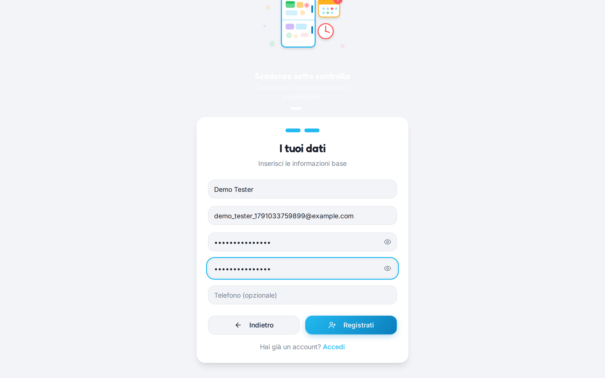

**Descrizione e scopo.** Raccolta delle informazioni minime per creare
l'utenza.

**Elenco funzionalità.**

| Elemento | Funzione |
| --- | --- |
| Campo "Nome e cognome" | Nome visualizzato nel profilo e nel saluto in home |
| Campo "Email" | Identificativo di accesso |
| Campo "Password" con icona occhio | Password, con interruttore di visibilità |
| Campo "Conferma password" con icona occhio | Verifica di digitazione |
| Campo "Telefono (opzionale)" | Recapito facoltativo |
| Pulsante "Indietro" | Torna alla scelta del profilo |
| Pulsante "Registrati" | Crea l'account |
| Link "Hai già un account? Accedi" | Scorciatoia verso il login |

**Esito test.** ✅ OK — tutti e quattro i campi obbligatori compilati dallo
script, nessun errore di console.

---

### 3.11 Registrazione — esito

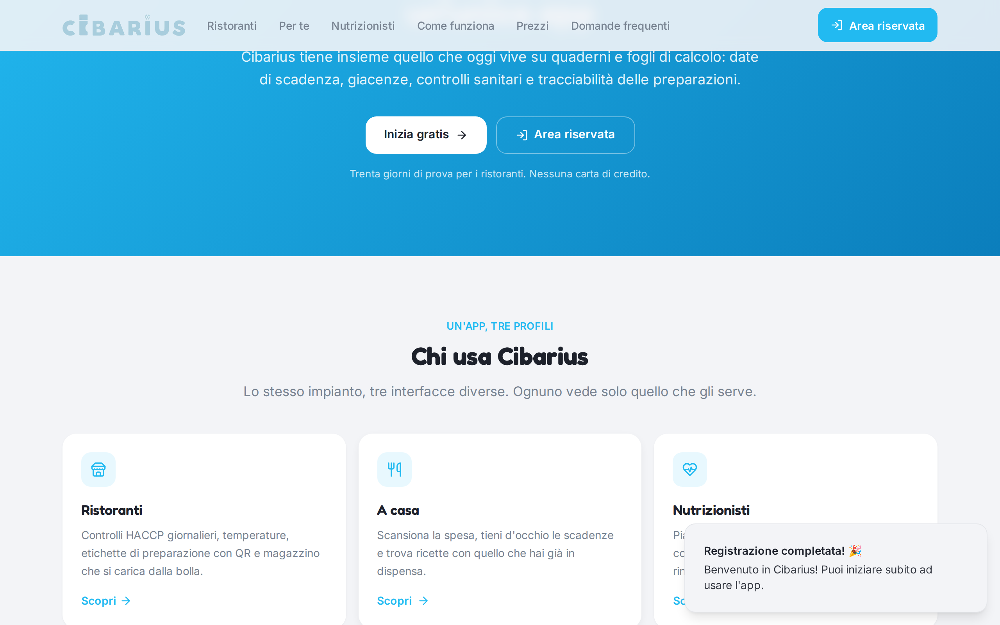

**Descrizione e scopo.** Conferma della creazione dell'account e primo
ingresso nell'app, con la dispensa ancora vuota.

**Elenco funzionalità.**

| Elemento | Funzione |
| --- | --- |
| Avviso "Registrazione completata! 🎉 — Benvenuto in Cibarius! Puoi iniziare subito ad usare l'app." | Conferma a comparsa in basso a destra |
| Blocco "Attenzione oggi — ✓ Nessuna scadenza urgente" | Stato iniziale, senza prodotti |
| Contatori "I tuoi alimenti" a zero | Frigo, congelatore e dispensa ancora vuoti |

**Esito test.** ✅ OK — account creato (verificato anche lato database: utenza
presente ed email già confermata) e atterraggio su `/app`. Prima della
correzione la registrazione rimandava alla home del sito pubblico: il messaggio
diceva "puoi iniziare subito ad usare l'app" e l'utente si ritrovava sulla
pagina commerciale a cercare "Area riservata".

---

### 3.12 Accesso

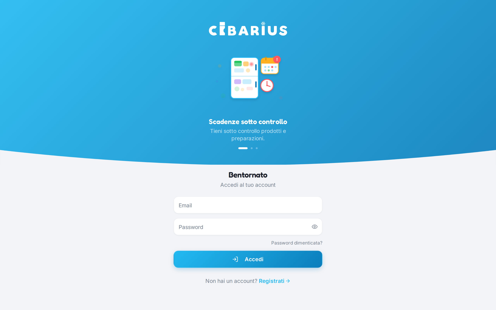

**Descrizione e scopo.** Pagina di login, raggiunta dopo aver azzerato la
sessione per riprodurre fedelmente il rientro di un utente già registrato.

**Elenco funzionalità.**

| Elemento | Funzione |
| --- | --- |
| Carosello illustrato "Scadenze sotto controllo" | Tre slide con indicatori a pallini |
| Campo "Email" | Identificativo |
| Campo "Password" con icona occhio | Credenziale, con interruttore di visibilità |
| Link "Password dimenticata?" | Avvia il recupero credenziali via email |
| Pulsante "Accedi" | Esegue l'autenticazione |
| Link "Non hai un account? Registrati" | Rimanda alla registrazione |

**Esito test.** ✅ OK — nessun errore di console.

---

### 3.13 Esito dell'accesso


**Descrizione e scopo.** Conferma che le credenziali create al passo precedente
funzionano: l'accesso porta direttamente alla home dell'app.

**Esito test.** ✅ OK — autenticazione riuscita, atterraggio su `/app`, nessun
errore di console. L'instradamento per ruolo funziona: un account `user` viene
mandato sulla home consumer e non su quella ristorante o professionale.

---

### 3.14 App — Home della giornata

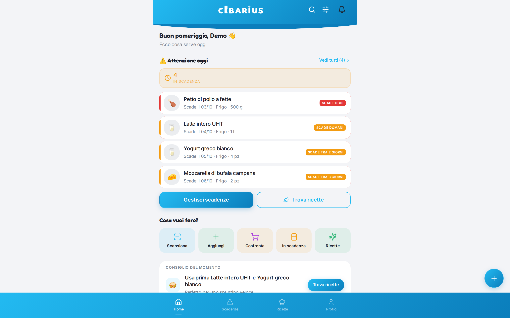

**Descrizione e scopo.** Cruscotto principale dell'utente domestico. Risponde a
una sola domanda: cosa serve fare oggi.

**Elenco funzionalità.**

| Elemento | Funzione |
| --- | --- |
| Barra superiore: lente, filtri, campanella | Ricerca prodotti, filtri rapidi, notifiche |
| Saluto contestuale "Buon pomeriggio, Demo 👋" | Personalizzazione con il nome e la fascia oraria |
| Blocco "Attenzione oggi" con contatore "3 in scadenza" | Riepilogo degli alimenti critici |
| Righe prodotto con etichetta colorata ("Scade oggi", "Scade domani", "Scade tra 2 giorni") | Petto di pollo, Latte intero UHT, Yogurt greco e Mozzarella con data, collocazione e quantità |
| Link "Vedi tutti (3)" | Apre l'elenco completo delle scadenze |
| Pulsante "Gestisci scadenze" | Porta a `/expiry` per smaltire o consumare |
| Pulsante "Trova ricette" | Porta alle ricette anti-spreco |
| Riquadro "Cosa vuoi fare?": Scansiona, Aggiungi, Confronta, In scadenza, Ricette | Cinque scorciatoie alle azioni frequenti |
| Scheda "Consiglio del momento" | Suggerimento generato sui prodotti in scadenza, con pulsante "Trova ricette" |
| Sezione "I tuoi alimenti" con link "Vedi tutti" | Anteprima della dispensa |
| Pulsante flottante `+` | Apre il flusso di inserimento prodotto da qualsiasi schermata |
| Barra inferiore: Home, Scadenze, Ricette, Profilo | Navigazione principale a quattro voci |

**Esito test.** ✅ OK — 28 elementi interattivi rilevati, i dieci prodotti di
prova correttamente classificati, nessun errore di console. Le etichette ora
coincidono con quelle delle altre schermate: il petto di pollo che scade oggi è
marcato "Scade oggi" qui, "in scadenza" nell'elenco e fra gli ingredienti
disponibili nelle ricette. Prima diceva "Scade domani".

---

### 3.15 App — Scadenze

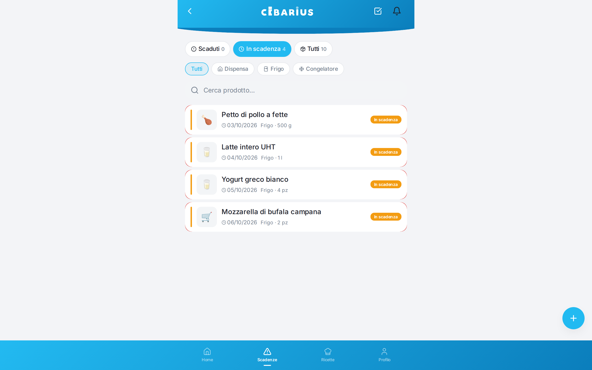

**Descrizione e scopo.** Elenco completo dei prodotti ordinato per data di
scadenza, con doppio livello di filtri.

**Elenco funzionalità.**

| Elemento | Funzione |
| --- | --- |
| Filtri di stato con contatore: "Scaduti 0", "In scadenza 4", "Tutti 10" | Selezione per criticità; i contatori sono calcolati sui dati reali |
| Filtri di collocazione: Tutti, Dispensa, Frigo, Congelatore | Selezione per luogo di conservazione |
| Campo "Cerca prodotto…" | Ricerca testuale nell'elenco |
| Righe prodotto con bordo colorato e badge "in scadenza" | Nome, data, collocazione e quantità |
| Pulsante flottante `+` | Aggiunta rapida di un prodotto |

**Esito test.** ✅ OK — i quattro prodotti in scadenza sono gli stessi mostrati
in home e il contatore coincide, cosa che prima non succedeva; il totale torna
con i dieci articoli caricati. Nessun errore di console.

---

### 3.16 App — Dispensa

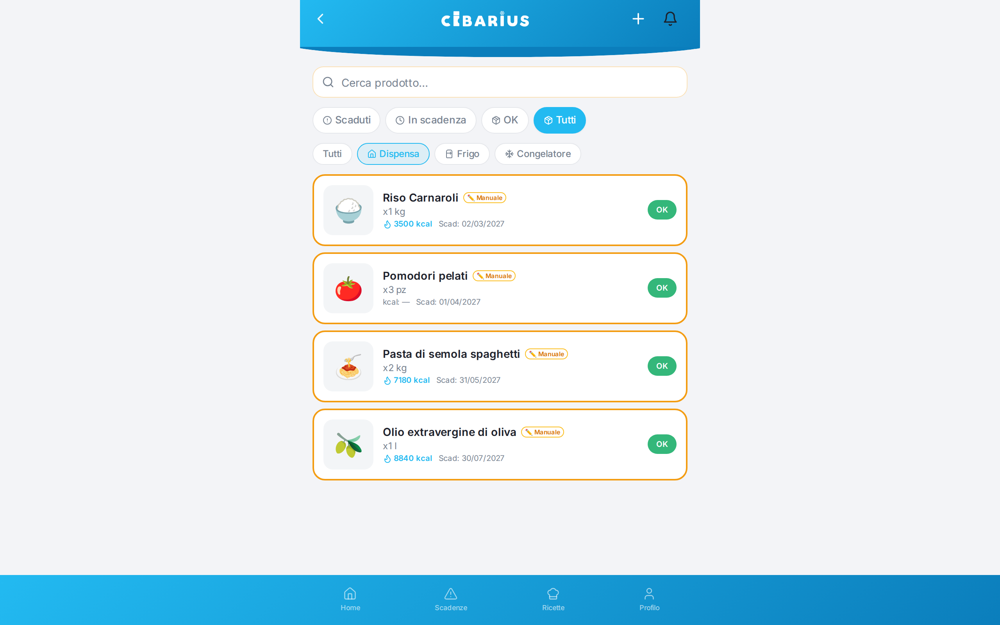

**Descrizione e scopo.** Vista della sola dispensa (conservazione a temperatura
ambiente), con il filtro "Dispensa" già applicato.

**Elenco funzionalità.**

| Elemento | Funzione |
| --- | --- |
| Pulsante `+` nella barra superiore | Aggiunta di un prodotto |
| Campo "Cerca prodotto…" | Ricerca testuale |
| Filtri di stato: Scaduti, In scadenza, OK, Tutti | Selezione per criticità |
| Filtri di collocazione con "Dispensa" attivo | Restringe la vista agli alimenti a temperatura ambiente |
| Schede prodotto | Immagine, nome, badge "Manuale" (origine del dato), quantità, calorie totali, data di scadenza e indicatore di stato "OK" |

**Esito test.** ✅ OK — i quattro prodotti a temperatura ambiente (riso, pelati,
pasta, olio) compaiono correttamente con le calorie calcolate, nessun errore di
console. Lo script non ha trovato un pulsante testuale "Aggiungi": in questa
schermata l'azione è affidata all'icona `+` della barra superiore.

---

### 3.17 App — Prodotti e ricerca

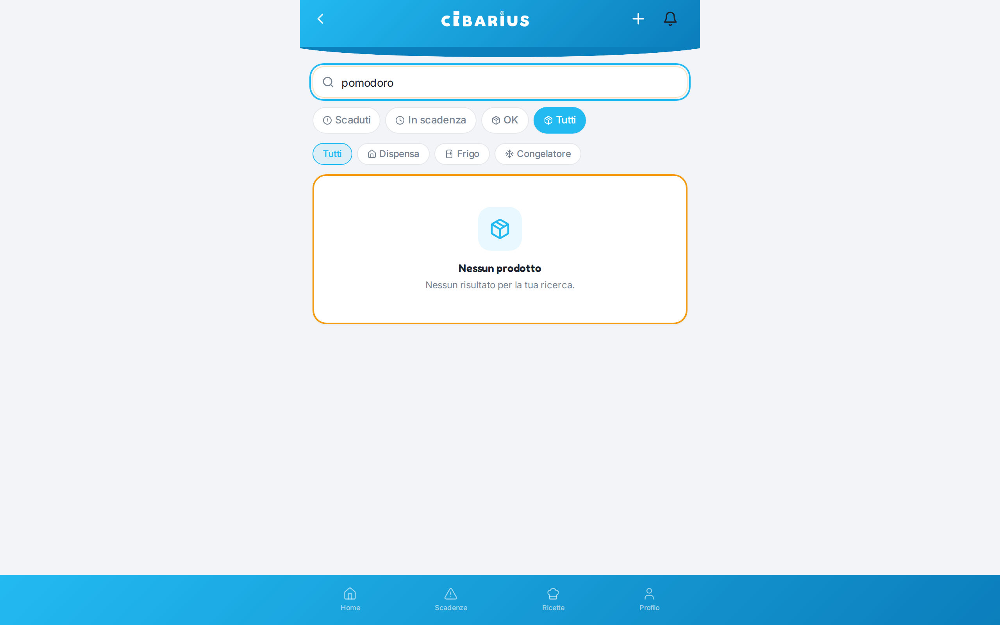

**Descrizione e scopo.** Stessa vista a elenco senza filtro di collocazione,
usata qui per provare la ricerca testuale.

**Elenco funzionalità.**

| Elemento | Funzione |
| --- | --- |
| Campo di ricerca | Filtra l'elenco mentre si digita |
| Filtri di stato e di collocazione | Come nella schermata Dispensa |
| Stato vuoto "Nessun prodotto — Nessun risultato per la tua ricerca." | Messaggio quando il filtro non produce risultati |
| Confronto tollerante | Trova il prodotto al singolare o al plurale, senza badare ad accenti e ordine delle parole |

**Esito test.** ✅ OK — la ricerca di "pomodoro" restituisce "Pomodori pelati",
nessun errore di console. Prima non trovava nulla: il confronto era una
sottostringa esatta e in italiano singolare e plurale non si incontrano mai.

---

### 3.18 App — Congelatore

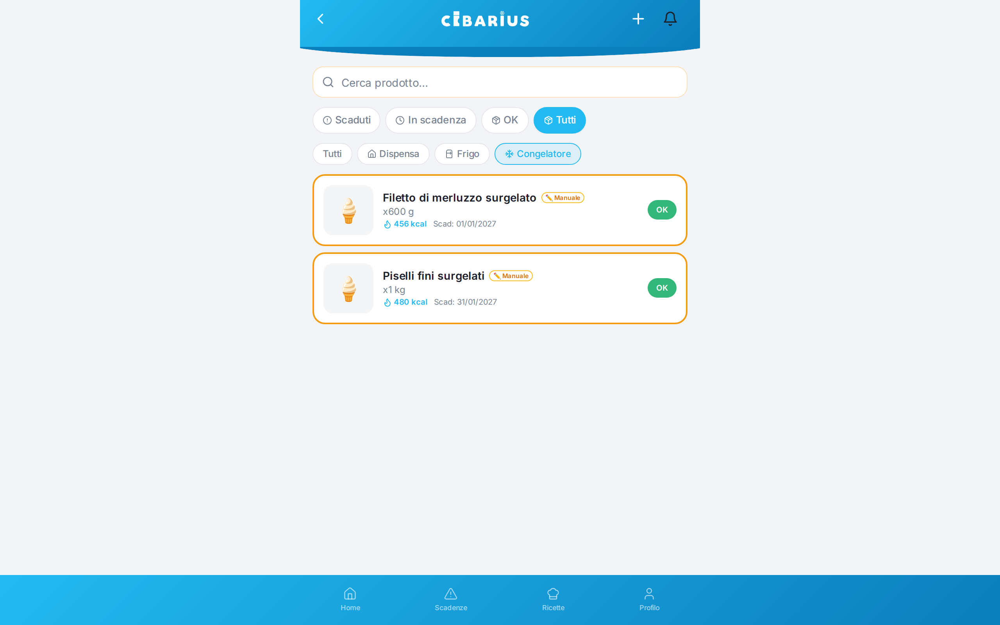

**Descrizione e scopo.** Vista delle sole scorte congelate, separate da dispensa
e frigo perché hanno orizzonti di scadenza molto più lunghi.

**Elenco funzionalità.**

| Elemento | Funzione |
| --- | --- |
| Filtro "Congelatore" attivo | Restringe la vista ai surgelati |
| Schede prodotto | Filetto di merluzzo e piselli fini, con quantità, calorie, scadenza e stato "OK" |
| Campo di ricerca e filtri di stato | Come nelle altre viste a elenco |

**Esito test.** ✅ OK — entrambi i surgelati caricati sono presenti e nessuno è
finito per errore nelle altre collocazioni, nessun errore di console.

---

### 3.19 App — Aggiungi alimento

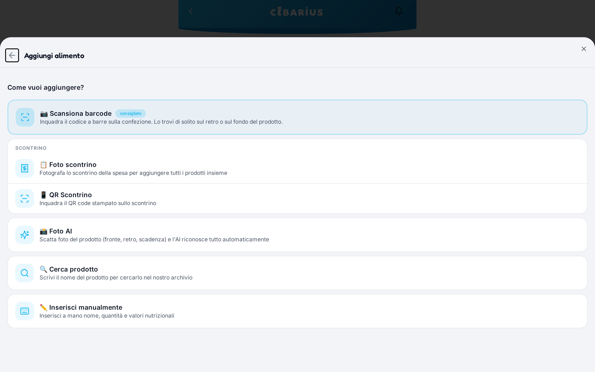

**Descrizione e scopo.** Pannello a tutta pagina che raccoglie tutti i modi di
far entrare un prodotto in dispensa. È il cuore funzionale dell'app: l'inserimento
manuale è l'ultima opzione, non la prima.

**Elenco funzionalità.**

| Elemento | Funzione |
| --- | --- |
| "Scansiona barcode" (badge "consigliato") | Legge il codice a barre della confezione |
| "Foto scontrino" | Fotografa lo scontrino e aggiunge tutti i prodotti insieme |
| "QR Scontrino" | Inquadra il QR code stampato sullo scontrino |
| "Foto AI" | Riconosce nome, barcode, valori nutrizionali e scadenza da foto del prodotto |
| "Cerca prodotto" | Ricerca per nome nell'archivio |
| "Inserisci manualmente" | Inserimento a mano di nome, quantità e valori nutrizionali |
| Freccia indietro e `×` | Chiudono il pannello |

**Esito test.** ✅ OK — il pannello si apre e presenta tutte e sei le modalità,
nessun errore di console. Il browser di prova è senza fotocamera, quindi le
opzioni che la richiedono non sono state portate a termine: è una limitazione
dell'ambiente di test, non un difetto dell'app.

---

### 3.20 App — Ricette

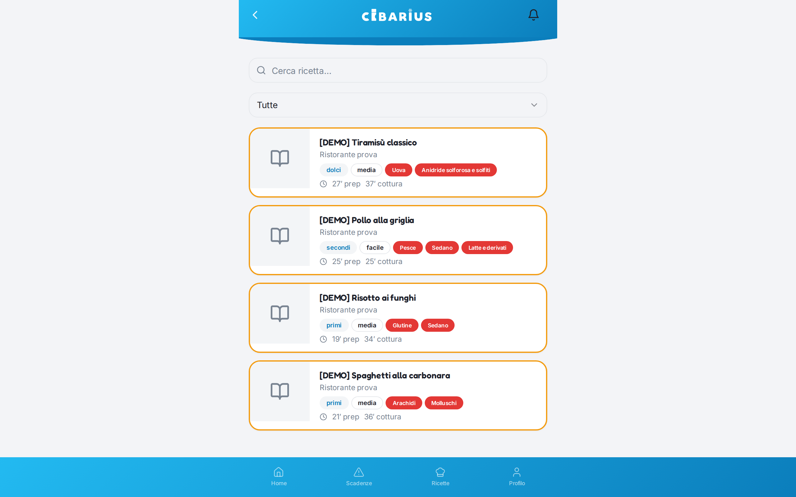

**Descrizione e scopo.** Catalogo delle ricette pubblicate, consultabile a
prescindere da cosa si ha in dispensa.

**Elenco funzionalità.**

| Elemento | Funzione |
| --- | --- |
| Campo "Cerca ricetta…" | Ricerca testuale |
| Menu a tendina "Tutte" | Filtro per categoria |
| Schede ricetta | Titolo, autore, categoria (dolci, primi, secondi), difficoltà, tempi di preparazione e cottura |
| Etichette rosse degli allergeni | Uova, anidride solforosa e solfiti, pesce, sedano, latte e derivati, glutine, arachidi, molluschi |

**Esito test.** ✅ OK — quattro ricette caricate con allergeni e tempi, nessun
errore di console. Le ricette presenti nell'ambiente di prova hanno il prefisso
`[DEMO]` e sono attribuite a "Ristorante prova": sono dati dimostrativi, non
contenuti editoriali definitivi.

---

### 3.21 App — Ricette dalla dispensa

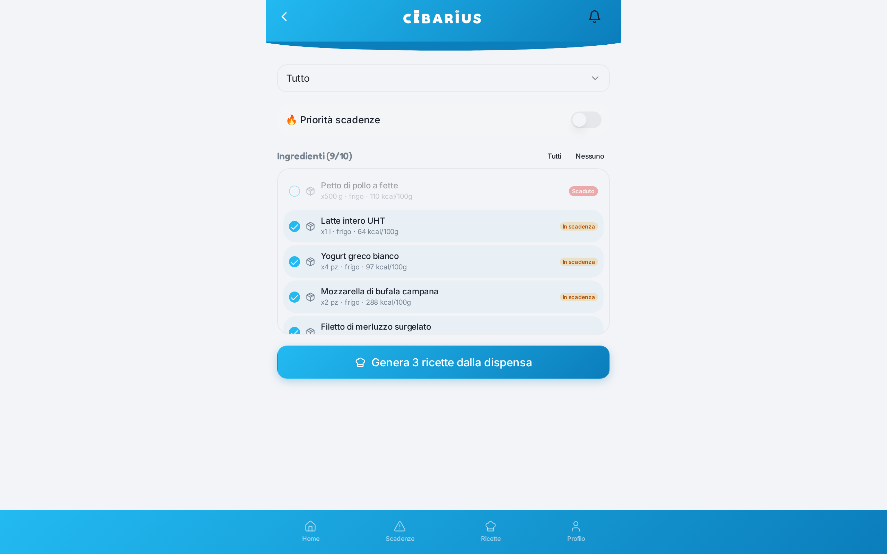

**Descrizione e scopo.** Generatore di ricette costruite sugli ingredienti
effettivamente disponibili. L'utente sceglie cosa mettere nel paniere e l'app
propone come usarlo.

**Elenco funzionalità.**

| Elemento | Funzione |
| --- | --- |
| Menu a tendina "Tutto" | Filtro sul tipo di portata |
| Interruttore "🔥 Priorità scadenze" | Dà precedenza agli ingredienti che stanno per scadere |
| Intestazione "Ingredienti (10/10)" con scorciatoie "Tutti" / "Nessuno" | Contatore e selezione in blocco |
| Righe ingrediente con segno di spunta | Nome, quantità, collocazione, calorie per 100 g e badge di stato ("Scaduto", "In scadenza") |
| Pulsante "Genera 3 ricette dalla dispensa" | Avvia la generazione sulle voci selezionate |

**Esito test.** ✅ OK — gli ingredienti ancora buoni sono selezionati in
automatico e le etichette coincidono con le altre schermate, nessun errore di
console. Prima il "Petto di pollo a fette" che scade oggi veniva marcato
"Scaduto" ed **escluso dalla selezione**: l'ingrediente più urgente era proprio
quello che restava fuori dalla ricetta che doveva salvarlo.

---

### 3.22 App — Anti spreco

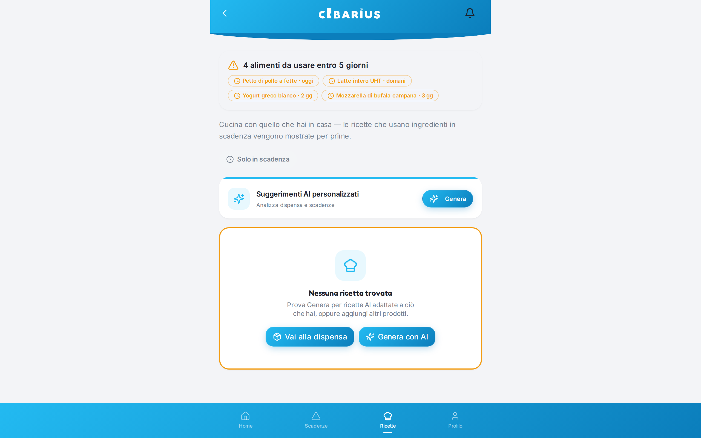

**Descrizione e scopo.** Vista dedicata al recupero dei prodotti prossimi alla
scadenza, con ricette filtrate e generazione assistita.

**Elenco funzionalità.**

| Elemento | Funzione |
| --- | --- |
| Riquadro "4 alimenti da usare entro 5 giorni" | Etichette con nome e scadenza (pollo oggi, latte domani, yogurt 2 gg, mozzarella 3 gg) |
| Filtro "Solo in scadenza" | Restringe le ricette a quelle che usano prodotti critici |
| Scheda "Suggerimenti AI personalizzati" + pulsante "Genera" | Analizza dispensa e scadenze e propone ricette su misura |
| Stato vuoto "Nessuna ricetta trovata" | Compare quando il catalogo non ha ricette compatibili |
| Pulsanti "Vai alla dispensa" e "Genera con AI" | Due vie d'uscita dallo stato vuoto |

**Esito test.** ✅ OK — conteggio e giorni residui corretti, stato vuoto gestito
con due azioni sensate, nessun errore di console. Questa pagina guarda cinque
giorni invece dei tre usati dagli avvisi, perché le servono abbastanza
ingredienti per far uscire una ricetta: ora lo scrive nell'intestazione, invece
di chiamarli "in scadenza" e contraddire il conteggio della home.

---

### 3.23 App — Lista della spesa

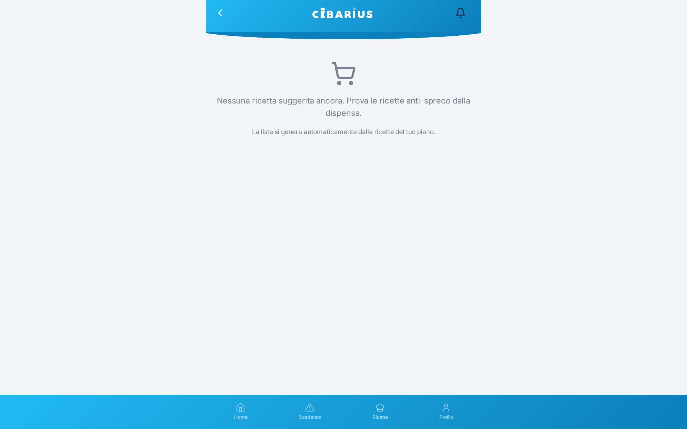

**Descrizione e scopo.** Lista della spesa derivata automaticamente dalle ricette
del piano, non compilata a mano.

**Elenco funzionalità.**

| Elemento | Funzione |
| --- | --- |
| Stato vuoto con icona carrello | "Nessuna ricetta suggerita ancora. Prova le ricette anti-spreco dalla dispensa." |
| Nota esplicativa | "La lista si genera automaticamente dalle ricette del tuo piano." |

**Esito test.** ✅ OK — nessun errore di console. Lo script non ha potuto
inserire una voce di prova perché la schermata non prevede l'aggiunta manuale:
la lista dipende interamente dalle ricette salvate. È una scelta di prodotto
legittima, ma vale la pena rivederla (vedi conclusioni).

---

### 3.24 App — Preparazioni

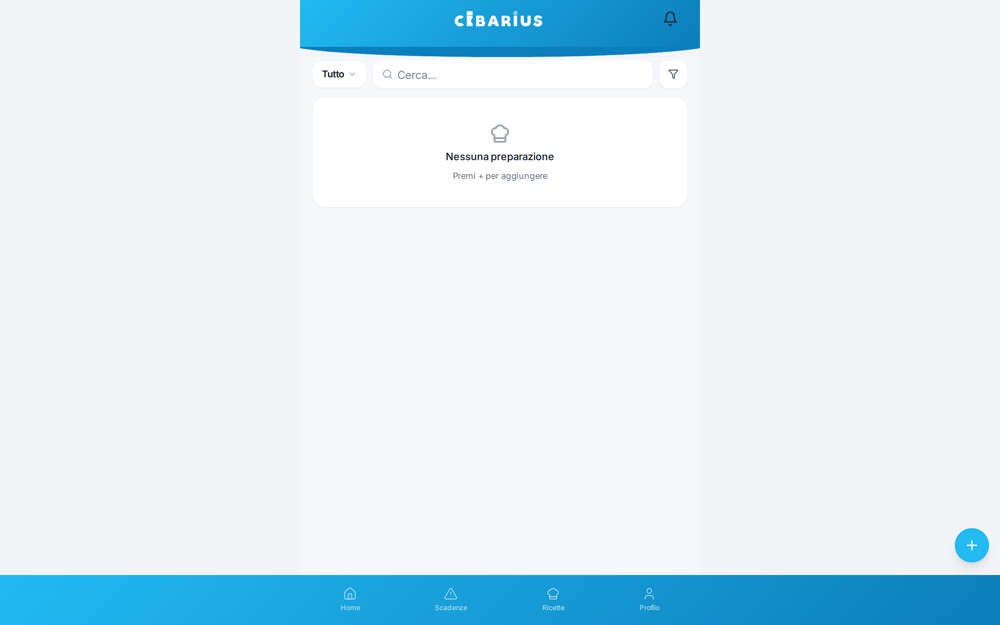

**Descrizione e scopo.** Archivio delle preparazioni dell'utente (semilavorati,
piatti pronti, porzionati) con la relativa scadenza interna.

**Elenco funzionalità.**

| Elemento | Funzione |
| --- | --- |
| Menu a tendina "Tutto" | Filtro per tipo di preparazione |
| Campo "Cerca…" | Ricerca testuale |
| Icona a imbuto | Filtri avanzati |
| Stato vuoto "Nessuna preparazione — Premi + per aggiungere" | Istruzione esplicita sull'azione da compiere |
| Pulsante flottante `+` | Crea una nuova preparazione |

**Esito test.** ✅ OK — stato vuoto corretto per un account nuovo, nessun errore
di console.

---

### 3.25 App — Preferiti

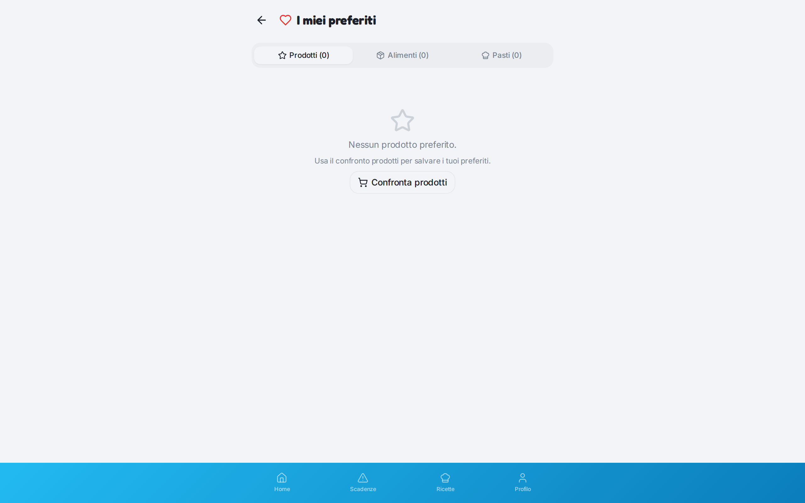

**Descrizione e scopo.** Raccolta di quello che l'utente ha messo da parte,
divisa per tipo di contenuto.

**Elenco funzionalità.**

| Elemento | Funzione |
| --- | --- |
| Schede "Prodotti (0)", "Alimenti (0)", "Pasti (0)" | Tre categorie di preferiti con contatore |
| Freccia indietro e titolo "I miei preferiti" | Intestazione e ritorno al profilo |
| Stato vuoto "Nessun prodotto preferito. Usa il confronto prodotti per salvare i tuoi preferiti." | Spiega come popolare la sezione |
| Pulsante "Confronta prodotti" | Porta allo strumento di confronto |

**Esito test.** ✅ OK — nessun errore di console. Nota: questa pagina usa
un'intestazione propria invece della barra azzurra comune alle altre schermate
dell'app (vedi conclusioni).

---

### 3.26 App — Promemoria

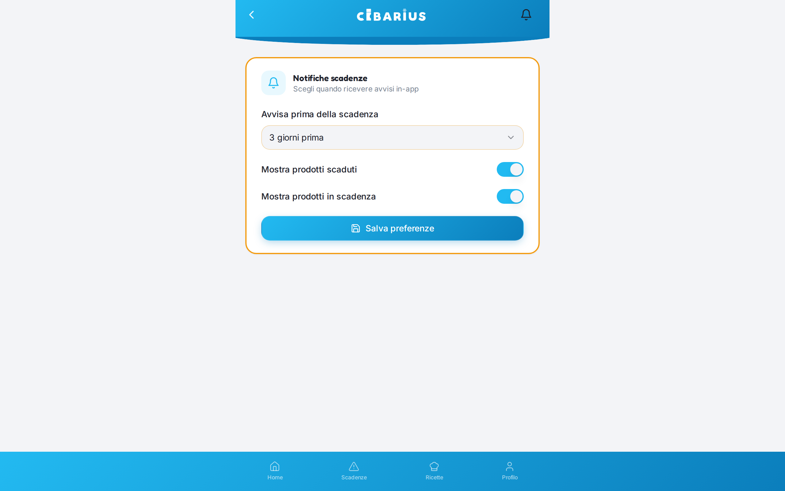

**Descrizione e scopo.** Configurazione degli avvisi in-app sulle scadenze.

**Elenco funzionalità.**

| Elemento | Funzione |
| --- | --- |
| Menu "Avvisa prima della scadenza" (valore "3 giorni prima") | Anticipo dell'avviso |
| Interruttore "Mostra prodotti scaduti" | Include o esclude gli scaduti dagli avvisi |
| Interruttore "Mostra prodotti in scadenza" | Include o esclude i prodotti in avvicinamento |
| Pulsante "Salva preferenze" | Rende effettive le impostazioni |

**Esito test.** ✅ OK — valori predefiniti sensati (3 giorni, entrambi gli
interruttori attivi), nessun errore di console.

---

### 3.27 App — Abbonamento

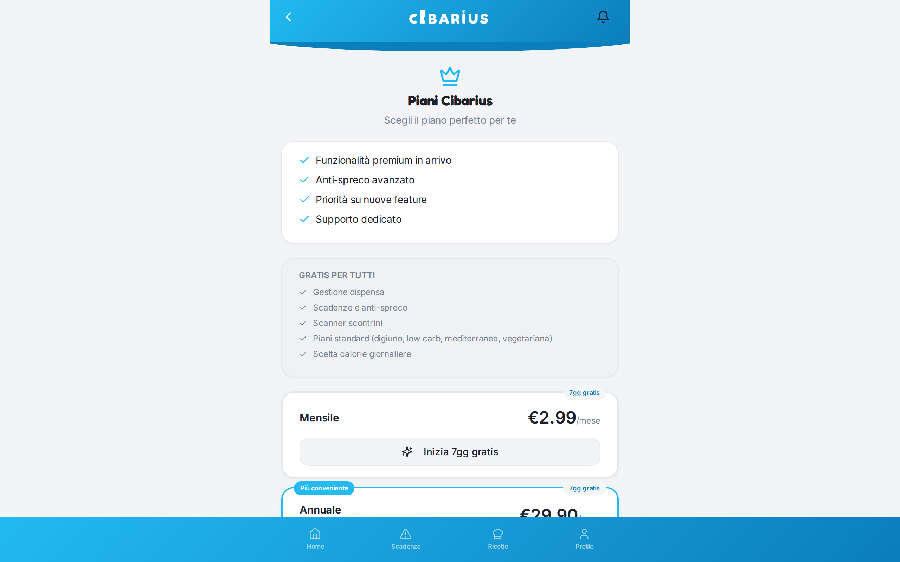

**Descrizione e scopo.** Presentazione del piano Premium per l'utente domestico,
con la distinzione fra ciò che è gratuito e ciò che è a pagamento.

**Elenco funzionalità.**

| Elemento | Funzione |
| --- | --- |
| Blocco dei vantaggi Premium | Funzionalità premium in arrivo, anti-spreco avanzato, priorità su nuove feature, supporto dedicato |
| Blocco "Gratis per tutti" | Gestione dispensa, scadenze e anti-spreco, scanner scontrini, piani standard, scelta calorie giornaliere |
| Piano "Mensile — €2,99/mese" con badge "7gg gratis" | Pulsante "Inizia 7gg gratis" |
| Piano "Annuale — €29,90" con badge "Più conveniente" | Alternativa annuale |

**Esito test.** ✅ OK — nessun errore di console. Gli importi arrivano dalla
tabella `subscription_plans`, cioè da quello che Stripe addebita davvero, e ora
coincidono con quelli annunciati sul sito.

---

### 3.28 App — Profilo

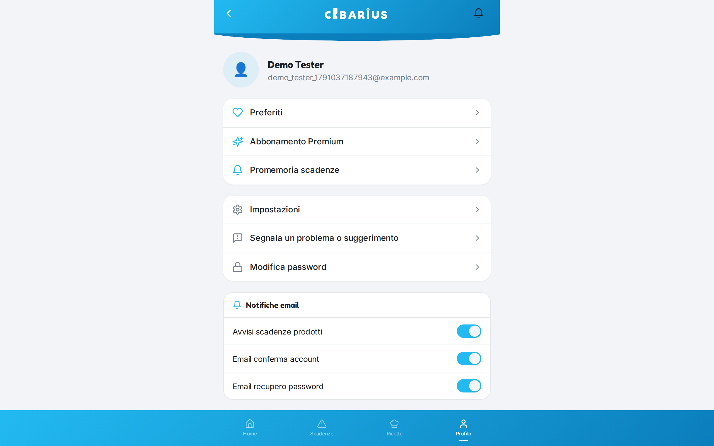

**Descrizione e scopo.** Centro delle impostazioni personali e punto di accesso
alle sezioni secondarie.

**Elenco funzionalità.**

| Elemento | Funzione |
| --- | --- |
| Intestazione con avatar, nome ed email | Identità dell'account (`demo_tester_1791033759899@example.com`) |
| Voce "Preferiti" | Porta a `/favorites` |
| Voce "Abbonamento Premium" | Porta a `/subscription` |
| Voce "Promemoria scadenze" | Porta a `/reminders` |
| Voce "Impostazioni" | Preferenze generali |
| Voce "Segnala un problema o suggerimento" | Assistenza collegata all'account |
| Voce "Modifica password" | Cambio credenziali |
| Interruttore "Avvisi scadenze prodotti" | Email di avviso scadenza |
| Interruttore "Email conferma account" | Email di conferma registrazione |
| Interruttore "Email recupero password" | Email di recupero credenziali |

**Esito test.** ✅ OK — nome ed email corrispondono a quanto inserito in
registrazione, le tre preferenze email sono attive per impostazione predefinita,
nessun errore di console. Lo script ha contato zero elementi `role="tab"`: il
profilo è organizzato a elenco di voci, non a schede.

---

### 3.29 Permessi — area ristorante negata


**Descrizione e scopo.** Verifica di sicurezza: un account con ruolo `user`
tenta di aprire `/restaurant`.

**Esito test.** ✅ OK — la guardia di ruolo intercetta la richiesta e riporta
l'utente su `/app`. Nessun contenuto dell'area ristorante viene mostrato, nemmeno
per un istante, e non compaiono errori di console.

---

### 3.30 Permessi — area amministrazione negata


**Descrizione e scopo.** Stessa verifica su `/admin`.

**Esito test.** ✅ OK — redirezione su `/app`, nessuna traccia del pannello di
amministrazione, nessun errore di console.

---

## 4. Conclusioni, correzioni e suggerimenti

### Quadro generale

Il giro completo si chiude con **30 schermate su 30 raggiunte e zero errori di
console o eccezioni JavaScript**. L'autenticazione, l'instradamento per ruolo e
le guardie di permesso funzionano come previsto: un account `user` atterra sulla
home consumer e viene respinto sia dall'area ristorante sia da quella di
amministrazione. Tutte le schermate reggono bene lo stato vuoto, con messaggi
che spiegano cosa fare invece di limitarsi a dire che non c'è nulla — un
dettaglio spesso trascurato e qui curato ovunque.

I quattro difetti emersi dal primo giro sono stati corretti e verificati con un
secondo giro completo sulla versione sistemata.

### Difetti rilevati e corretti

**1. Stati di scadenza incoerenti fra le schermate.** Il "Petto di pollo a
fette" con scadenza odierna veniva etichettato in tre modi diversi: "Scade
domani" in home, "in scadenza" nella pagina Scadenze, "Scaduto" nella
generazione ricette — dove per di più finiva *escluso* dalla selezione, cioè
l'ingrediente più urgente era l'unico a restare fuori dalla ricetta che doveva
salvarlo.

La causa non era l'arrotondamento ma il fuso orario: `new Date("2026-10-03")`
produce la mezzanotte **UTC**, che veniva confrontata con la mezzanotte
**locale**. In Italia, due ore avanti, il conto slittava di un giorno. Sopra ci
si erano stratificati tre modi diversi di arrotondare: `Math.ceil` dalla
mezzanotte in home, una divisione senza arrotondamento nell'elenco, la
differenza da `Date.now()` nelle ricette.

```
mezzanotte locale  2026-10-02T22:00:00Z
new Date("2026-10-03")  2026-10-03T00:00:00Z   <- due ore avanti

home        Math.ceil(0,083) = 1   -> "Scade domani"
elenco      0,083                  -> "in scadenza"
ricette     -0,58 da Date.now()    -> "Scaduto"
```

Ora `src/lib/expiry-status.ts` legge le date come mezzanotte locale e arrotonda
una volta sola; le dodici reimplementazioni sparse fra app consumer, area
ristorante e suite professionale chiamano lui. Il modulo copre anche il
passaggio all'ora legale, dove fra due giorni consecutivi passano 23 o 25 ore.
Tredici test lo verificano, incluso il caso che ha prodotto il difetto.

**2. La ricerca prodotti non tollerava singolare e plurale.** Cercare "pomodoro"
non trovava "Pomodori pelati". Per un'app italiana, dove la differenza fra
singolare e plurale è continua, il confronto per sottostringa esatta non basta.

`src/lib/text-match.ts` normalizza il testo (minuscole, via gli accenti e la
punteggiatura) e confronta ogni parola anche nelle sue forme singolare e
plurale, accettando le parole in ordine diverso da quello dell'etichetta. Le
desinenze velari hanno la precedenza sulla regola generale, altrimenti da
"pesca" uscirebbe "pesce": è il motivo per cui le varianti si generano una
desinenza alla volta invece di troncare la parola a una radice comune.

**3. Dopo la registrazione si finiva sul sito pubblico.** L'avviso diceva "puoi
iniziare subito ad usare l'app" ma la navigazione portava a `/`, la pagina
commerciale, e l'utente doveva trovare da sé "Area riservata" — pur avendo già
una sessione aperta. Ora la registrazione porta alla home del ruolo scelto. Se
in futuro la conferma via email venisse richiesta, e quindi la sessione non
fosse ancora aperta, l'utente viene mandato al login con un messaggio che glielo
dice, invece di sbattere contro una guardia di autenticazione.

**4. Due listini diversi per lo stesso prodotto.** La pagina pubblica `/prezzi`
descriveva l'uso domestico come "Gratis" e basta, mentre dentro l'app compariva
un piano a 2,99 € al mese di cui il sito non diceva nulla: chi arrivava da lì
non si aspettava un paywall. Ora il piano Premium compare sul sito con gli
importi veri, il periodo di prova e lo stesso nome che usa l'app, e le cifre
stanno in `src/lib/pricing.ts` invece di essere ripetute in quattro pagine.
Dentro l'app i prezzi continuano ad arrivare da `subscription_plans`, che resta
la sola fonte usata per incassare.

### Migliorie di UX ancora aperte

Queste non sono state toccate: sono scelte di prodotto più che difetti, e vale
la pena decidano le persone.

**Sfruttare lo spazio sugli schermi larghi.** A 1280×800 l'app consumer resta una
colonna stretta al centro, con ampi margini vuoti ai lati. La scelta
mobile-first è corretta per il caso d'uso, ma su desktop una disposizione a due
colonne (scadenze a sinistra, azioni e suggerimenti a destra) recupererebbe
spazio senza stravolgere il codice: basta un breakpoint `lg:` sui contenitori
principali.

**Uniformare l'intestazione.** La pagina Preferiti usa un'intestazione propria
(freccia e titolo su sfondo chiaro) mentre tutte le altre schermate dell'app
hanno la barra azzurra con il logo. La discontinuità si nota passando dal profilo
ai preferiti.

**Rendere l'azione "aggiungi" riconoscibile.** Nelle viste a elenco l'aggiunta è
affidata a una `+` senza etichetta nella barra superiore, mentre altrove c'è un
pulsante flottante. Un'etichetta accessibile (`aria-label="Aggiungi prodotto"`)
renderebbe l'azione raggiungibile da lettore di schermo e dagli strumenti di
test, oltre che più chiara a colpo d'occhio.

**Consentire l'aggiunta manuale alla lista della spesa.** Oggi la lista si popola
solo dalle ricette salvate. Un campo di inserimento libero coprirebbe il caso
più comune ("mi serve il detersivo") senza togliere nulla alla generazione
automatica.

**Sostituire le ricette dimostrative.** Il catalogo contiene quattro voci con
prefisso `[DEMO]` attribuite a "Ristorante prova". Vanno rimosse o sostituite con
contenuti reali prima di qualunque rilascio.

### Note tecniche sull'esecuzione del test

Due ostacoli hanno richiesto un intervento nello script e vale la pena
annotarli, perché si ripresenteranno a chiunque automatizzi questa app:

- **La procedura guidata di benvenuto copre tutto.** Al primo accesso parte un
  walkthrough a schermo intero che rendeva identici tutti gli screenshot. Si
  disattiva impostando in `localStorage` le chiavi `cibarius_onboarding_done` e
  `cibarius_tour_done` prima del caricamento della pagina.
- **La sessione Supabase vive in `localStorage`, non nei cookie.** Cancellare i
  cookie non disconnette: per fotografare la pagina di accesso serve un contesto
  browser nuovo, che è la strada scelta dallo script.

### Come riprodurre

```bash
npm run dev -- --port 5182 --host 0.0.0.0   # server di sviluppo
node scripts/auto_test_report.js            # giro completo con screenshot
npx vitest run                              # i test dei moduli condivisi
```

Lo script accetta `BASE_URL`, `DEMO_EMAIL`, `DEMO_PASSWORD` e `SKIP_SIGNUP=1`
(quest'ultimo per ripartire dal login con un account esistente). Dopo la
registrazione attende il file `report/.seeded` per dare modo di caricare dati di
prova: se non arriva entro tre minuti prosegue con l'account vuoto.

L'account usato per questo report è rimasto attivo per permettere di verificare
i rilievi. Per rimuoverlo insieme ai dieci prodotti dimostrativi:

```sql
delete from auth.users where email like 'demo_tester_%@example.com';
delete from public.products
 where data_source = 'manual'
   and name in ('Latte intero UHT','Yogurt greco bianco','Mozzarella di bufala campana',
                'Petto di pollo a fette','Pomodori pelati','Pasta di semola spaghetti',
                'Olio extravergine di oliva','Riso Carnaroli','Piselli fini surgelati',
                'Filetto di merluzzo surgelato');
```
